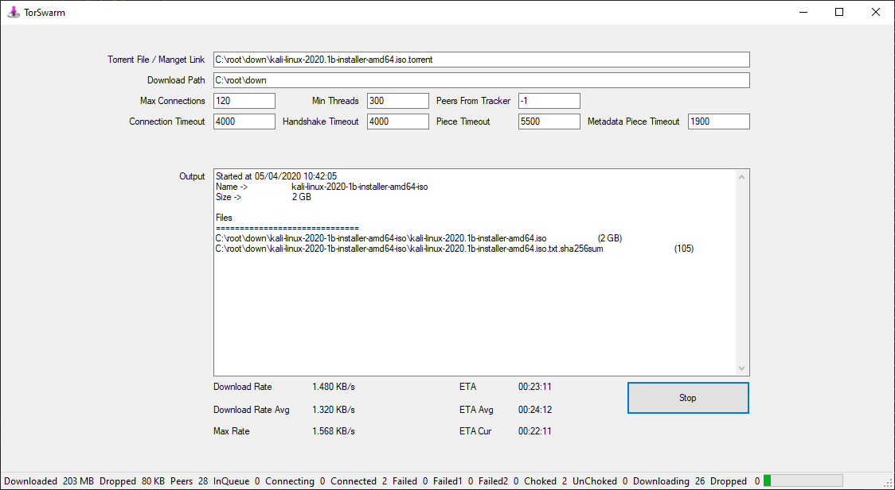
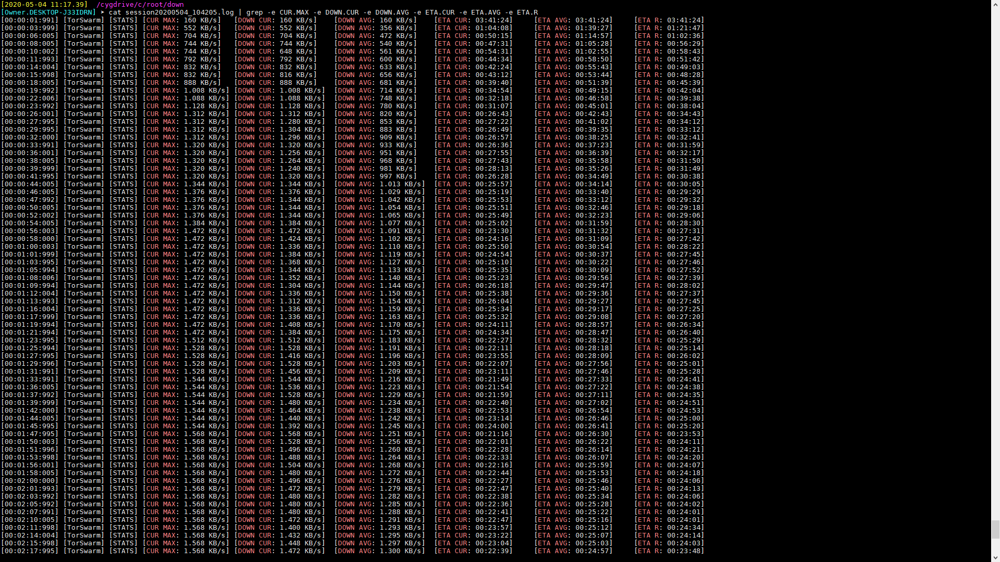
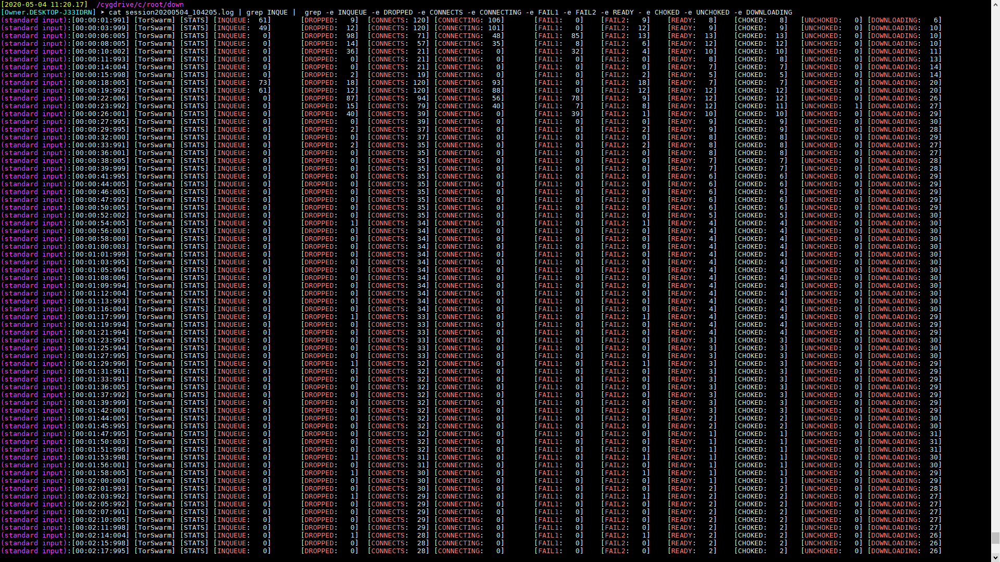
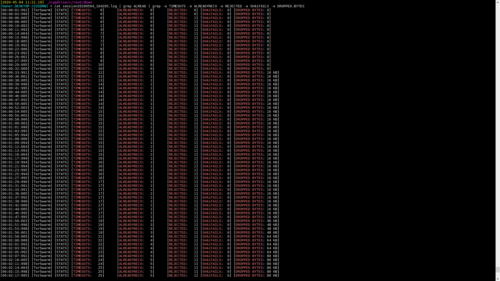

# TorSwarm

## Introduction
I've always found P2P architectures a very exciting and interesting field but I've never actually mess with it. That was the main reason that I decided to design and develop a Torrent Client. Another good reason was to later combine it with my other AV player project (<a href="https://github.com/SuRGeoNix/MediaRouter">MediaRouter</a>) for torrent streaming.

## Design

TorSwarm implements __Bittorrent Protocol v2__ (<a href="http://bittorrent.org/beps/bep_0052.html">bep_0052</a>) to achieve the following:-

1) Properly read input of a __Torrent File__ or __Magnet Link__ and extract all the required information for the P2P communication
 (such as *Info-Hash, Name, Size, Trackers, Paths/Sizes, Piece Length, Piece Hashes*)
 *See Torrent.cs*
		
2) Communicate periodically (when and if required) with the __Trackers__ to collect more __Peers__ (Scrape / Announce)
 *See Tracker.cs*

3) Communicate with the collected __Peers__ and start downloading __Metadata__ (if required) and __Torrent data__
 *See Peer.cs, BitField.cs*

4) Saves received data to __Part Files__ and creates the completed files when done
 *See TorSwarm.cs, PartFile.cs*

## Limitations

What TorSwarm does and what it doesn't:-

1) __Tracker__ communication is implemented over common __UDP Protocol__ (doesn't currently support *TCP or HTTP Trackers*)

2) __Peer__ communication is implemented over common __TCP Protocol__ (doesn't currently support *uTP, NAT Traversal, PnP, Hole-punching* etc.)

3) Peer messages communication supports __Core Protocol__ (<a href="http://bittorrent.org/beps/bep_0052.html">bep_0052</a>), __Fast Extension__ (<a href="http://bittorrent.org/beps/bep_0006.html">bep_0006</a>) and for the __Extension Protocol__ (<a href="http://bittorrent.org/beps/bep_0010.html">bep_0010</a>) it supports __Metadata Extension__ (<a href="http://bittorrent.org/beps/bep_0009.html">bep_0009</a>). It does not support *DHT (<a href="http://bittorrent.org/beps/bep_0005.html">bep_0005</a>) and PEX (<a href="http://bittorrent.org/beps/bep_0011.html">bep_0011</a>)*.
   
4) The whole implementation supports __Multi-Threading__ with a number of __Parametrized Options__, __Logging__ and __Statistics__. It does not currently support setting *Download & Upload Limits*.

5) __It does not currently support Pausing a current session or Loading an existing one!__

## Remarks

This project has been created for fun and educational reasons. Hopefully, it will help other developers to understand deeper the bittorrent protocol as the documentations and standars are very complicated and messy. I tried to add detailed comments within the code. Don't use it as is, it does not currently implement upload and sharing, which means that it is an arrogant and selfish beggar!

| Logs Sample | Stats Sample 1 |
| :-------------:       |:-------------:            |
|  |  |

| Stats Sample 2 | Stats Sample 3 |
| :-------------:       |:-------------:            |
|  |  |